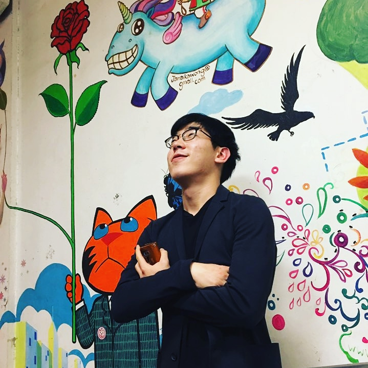
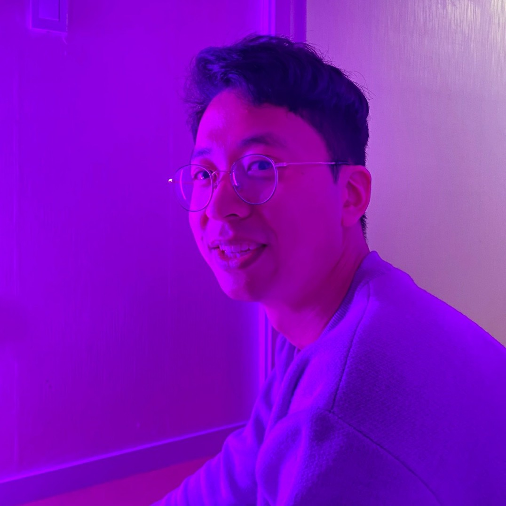

# ConnetingTheDots-GDSC-Solution-Challenge-2023

|                         Hyunmin Yoo                          |                         Minuk Hwang                          |                         Youngjin Ahn                         |                          Inyeob Kim                          |
| :----------------------------------------------------------: | :----------------------------------------------------------: | :----------------------------------------------------------: | :----------------------------------------------------------: |
|     |       |     |      |
| [uhmin99](https://github.com/uhmin99) | [minukHwang](https://github.com/minukHwang) | [snoop2head](https://github.com/snoop2head) | [inshining](https://github.com/inshining) |

### Contribution & Repository Structure

All of the source codes are available in forms of embedded git submodules.

- Flutter by Hyunmin Yoo available [@dot_connect_flutter](https://github.com/gdsc-ys/dot_connect_flutter)
- Server by Inyeob Kim available [@dot-connect-server](https://github.com/gdsc-ys/dot-connect-server) and [@dot-connect-python-server](https://github.com/inshining/dot-connect-python-server/)
- ML by Youngjin Ahn available [@DotT5](https://github.com/snoop2head/DotT5/) and [@DotNeuralNet](https://github.com/snoop2head/DotNeuralNet)
- Design and Web by Minuk Hwang available [@dot-connect](https://github.com/minukHwang/dot-connect/)

