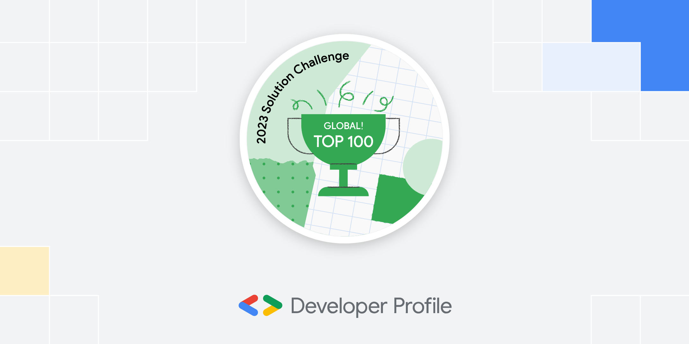
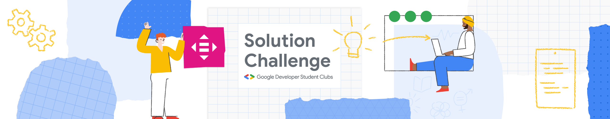
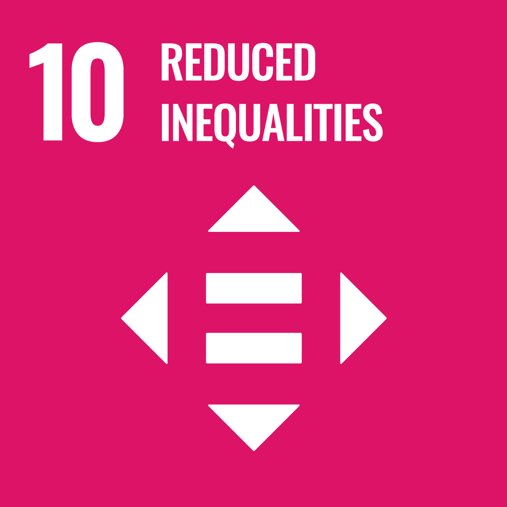
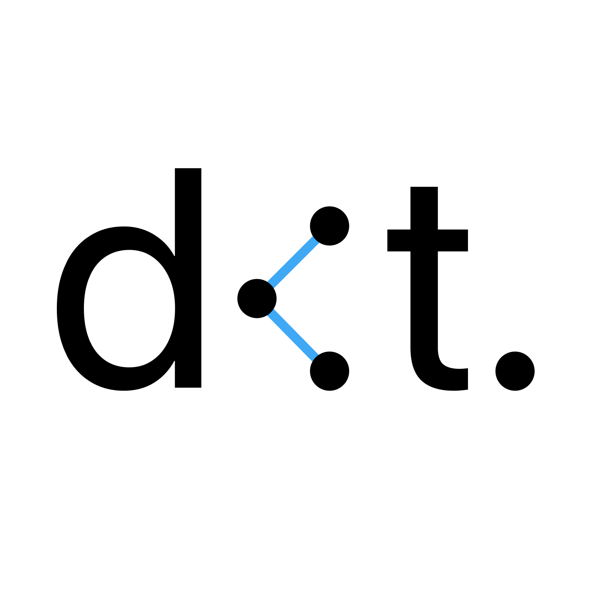
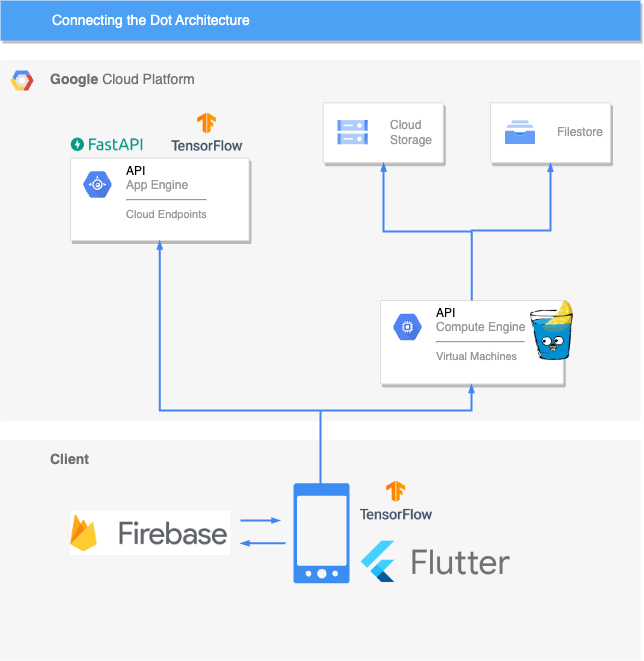

# Connecting-the-Dots: Braille Accessibility App

### [Global Top 100! Solution Challenge 2023](https://developers.google.com/community/gdsc-solution-challenge/winners?hl=ko)

Welcome to Connect-the-Dots, a mobile application designed to enhance braille awareness and accessibility for both visually impaired and sighted individuals.

Our app aims to make braille more approachable and to encourage a well-coexisting society.

This is our Youtube video introducing Connecting-the-Dots Project.
[https://youtu.be/lPTpxum68d4?si=5PDGBs5znT_Ydjrk](https://youtu.be/lPTpxum68d4?si=5PDGBs5znT_Ydjrk)

 

### Table of Content

- [Introduction](#introduction)
- [Installation](#install)
- [Features](#features)
- [Usage](#usage)
- [In-App Screens](#in-app)
- [Future Plans](#future-plans)
- [Project Structure](#structure)
- [Contributors](#team-members)
- [License](#license)

 

------

## 🔎 Introduction

Connect-the-Dots is an innovative mobile application aimed at bridging the gap between sighted and visually impaired individuals by increasing braille awareness and accessibility. Our solution addresses the challenges of inaccurate and insufficient braille in public spaces, promoting a more inclusive environment for everyone.

### UN Sustainable Development Goals

- Goals 4 - Quality Education
- Goals 10 - Reduced Inequalities

 

## 📂 Installation

Downlad APK for android [HERE](https://drive.google.com/file/d/1E8bA4USMCyfeo7sZTLlj5UNWw3JewiZR/view?usp=sharing).

If you wish to build codes locally, please visit each repositories for detailed descriptions.

 

## ✨ Features

1. **Braille Translation**: Capture an image of braille text, and our app translates it into normal text. It helps users lookup braille without learning it, making braille more accessible and improving awareness.

2. **Braille Dictionary**: Enter text and see its equivalent in braille, allowing users to learn how words are represented in braille.

3. **Report Wrong Braille**: Users can report incorrect or inaccurately placed braille in public areas, contributing to fixing these issues and enhancing accessibility for visually impaired individuals.

 

## 📱 Usage

Our app offers two modes for better user experience and accessibility:

1. **Simple Mode**: Designed for visually impaired users, Simple Mode provides an easy-to-use interface with TalkBack and VoiceOver support.
2. **Detailed Mode**: Intended for sighted users, Detailed Mode offers a comprehensive interface to interact with the app's features.

 

##  In-App Screens

### Splash & Login

### Translate Braille

### Braille Dictionary

### Report Braille

### Detail Mode

 

## 🔮 Future Plans

1. Improve braille detection and translation accuracy.
2. Expand supported languages for braille translation.
3. Collaborate with government and companies to address reported issues with braille in public spaces.

 

## 🛠 Project Structure

 

## 👥 Contribution & Repository Structure

|                         Hyunmin Yoo                          |                         Minuk Hwang                          |                         Youngjin Ahn                         |                          Inyeob Kim                          |
| :----------------------------------------------------------: | :----------------------------------------------------------: | :----------------------------------------------------------: | :----------------------------------------------------------: |
|     |       |     |      |
| [ uhmin99](https://github.com/uhmin99) | [ minukHwang](https://github.com/minukHwang) | [ snoop2head](https://github.com/snoop2head) | [ inshining](https://github.com/inshining) |

 

### All of the source codes are available in forms of embedded git submodules.

- Flutter by Hyunmin Yoo available [@dot_connect_flutter](https://github.com/gdsc-ys/dot_connect_flutter)
- Server by Inyeob Kim available [@dot-connect-server](https://github.com/gdsc-ys/dot-connect-server) and [@dot-connect-python-server](https://github.com/inshining/dot-connect-python-server/)
- ML by Youngjin Ahn available [@DotT5](https://github.com/snoop2head/DotT5/) and [@DotNeuralNet](https://github.com/snoop2head/DotNeuralNet)
- Design and Web by Minuk Hwang available [@dot-connect](https://github.com/minukHwang/dot-connect/)

 

## License

This project is licensed under the MIT License. See the [LICENSE](LICENSE) file for details.
